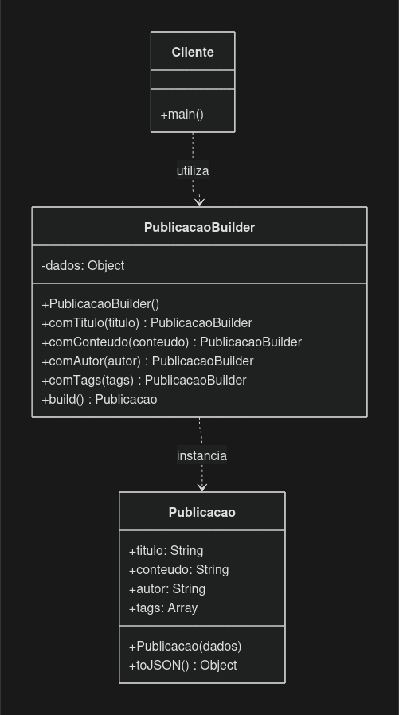
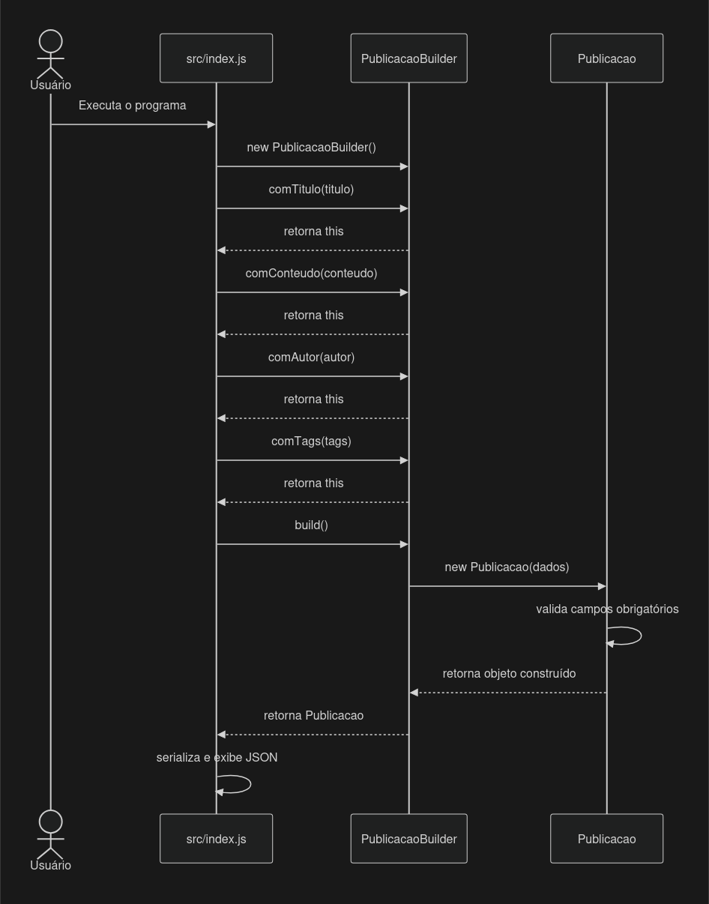
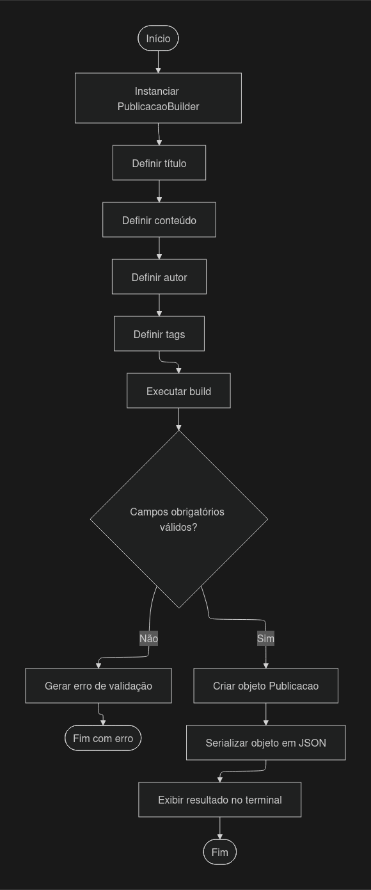

# 2. Modelagem

## 1. Introdução

A modelagem do padrão GoF Builder tem como objetivo representar a estrutura e o comportamento dos componentes responsáveis pela construção de uma publicação no contexto demonstrativo do Projeto Fórum.

A solução foi elaborada para demonstrar a construção gradual de um objeto que possui diferentes atributos, separando a configuração dos dados da criação da publicação final. Para isso, são utilizadas duas classes principais: `PublicacaoBuilder` e `Publicacao`.

A classe `PublicacaoBuilder` permite configurar os atributos individualmente, enquanto a classe `Publicacao` representa o objeto construído e realiza as validações dos campos obrigatórios.

Além dessas classes, o arquivo `src/index.js` representa o cliente da solução, responsável por utilizar o Builder e demonstrar a construção de uma publicação.

Esta modelagem corresponde à implementação demonstrativa em JavaScript. Ela não representa uma integração já realizada ao sistema principal do Projeto Fórum.

## 2. Diagrama de Classes UML

O diagrama de classes apresenta os componentes da solução, seus atributos, métodos e relacionamentos.

<p align="center">
  
</p>

<p align="center">
  <strong>Figura 1 — Diagrama de classes UML do padrão Builder aplicado à construção de publicações.</strong><br>
  Fonte: elaboração da SubEquipe01.
</p>


### 2.1 Interpretação do diagrama

O diagrama apresenta três componentes:

- **Cliente:** representa o programa `src/index.js`, que inicia o processo de construção e solicita a criação da publicação.
- **PublicacaoBuilder:** mantém temporariamente os dados informados e disponibiliza métodos para configurar os atributos da publicação.
- **Publicacao:** representa o objeto final, responsável por armazenar os atributos e validar os campos obrigatórios.

O cliente depende de `PublicacaoBuilder` para iniciar e configurar a construção. Por sua vez, `PublicacaoBuilder` depende de `Publicacao`, pois utiliza essa classe para criar o objeto final durante a execução do método `build()`.

As relações foram representadas como dependências porque os componentes utilizam os serviços uns dos outros, sem estabelecer uma associação estrutural permanente entre as instâncias.

## 3. Participantes do padrão Builder

O padrão Builder permite separar o processo de construção de um objeto de sua representação final. Na implementação proposta, seus participantes são organizados da seguinte maneira.

### 3.1 Builder concreto — `PublicacaoBuilder`

A classe `PublicacaoBuilder` implementa as operações necessárias para configurar os dados da publicação.

Seus métodos são:

| Método | Responsabilidade |
|---|---|
| `comTitulo(titulo)` | Define o título da publicação. |
| `comConteudo(conteudo)` | Define o conteúdo da publicação. |
| `comAutor(autor)` | Define o autor da publicação. |
| `comTags(tags)` | Define a lista de tags, exigindo um array. |
| `build()` | Cria e retorna uma instância de `Publicacao`. |

Os métodos de configuração retornam `this`, permitindo encadear chamadas consecutivas.

Por exemplo:

```javascript
new PublicacaoBuilder()
    .comTitulo("Padrões de Projeto GoF")
    .comConteudo("Estudo do padrão Builder.")
    .comAutor("Autor demonstrativo")
    .comTags(["GoF", "Arquitetura"])
    .build();
```

Essa abordagem torna a construção mais explícita e facilita a leitura do código cliente.

### 3.2 Produto — `Publicacao`

A classe `Publicacao` representa o objeto produzido pelo Builder.

Ela contém os seguintes atributos:

| Atributo | Tipo | Descrição |
|---|---|---|
| `titulo` | String | Título da publicação. |
| `conteudo` | String | Texto principal da publicação. |
| `autor` | String | Identificação textual demonstrativa do autor. |
| `tags` | Array | Lista de tags associadas à publicação. |

O construtor verifica se título, conteúdo e autor foram informados. Caso algum desses campos esteja ausente ou vazio, é lançado um erro.

A classe também remove espaços externos dos campos textuais e elimina tags repetidas ou vazias.

O método `toJSON()` disponibiliza os dados da publicação em um objeto adequado para serialização JSON.

### 3.3 Cliente — `src/index.js`

O cliente é responsável por utilizar o Builder para construir uma publicação.

Ele define os atributos por meio de chamadas encadeadas, executa o método `build()` e apresenta o resultado no terminal.

O cliente não precisa construir manualmente o objeto final nem executar diretamente suas validações. Essas responsabilidades ficam concentradas nas classes correspondentes.

## 4. Diagrama de Sequência UML

O diagrama de sequência representa a ordem das interações realizadas durante a construção de uma publicação.

## 3. Diagrama de Sequência UML

O diagrama de sequência representa a interação entre o usuário, o arquivo principal, o Builder e o objeto `Publicacao` durante o processo de construção de uma publicação.

<p align="center">
  
</p>

<p align="center">
  <strong>Figura 2 — Diagrama de sequência do padrão Builder aplicado à construção de publicações.</strong><br>
  Fonte: elaboração da SubEquipe 01.
</p>

### 4.1 Descrição da sequência

O processo começa quando o programa cliente é executado. Em seguida, ele instancia `PublicacaoBuilder` e configura os atributos da publicação.

Cada método de configuração armazena o valor recebido e retorna o próprio Builder, permitindo a continuidade da sequência.

Depois da configuração, o cliente chama `build()`. O Builder utiliza os dados armazenados para instanciar `Publicacao`.

Durante a criação, a classe `Publicacao` valida os campos obrigatórios. Se os dados forem válidos, o objeto é retornado ao Builder e, posteriormente, ao cliente.

Por fim, o cliente serializa os dados em JSON e apresenta o resultado no terminal.

Se um campo obrigatório estiver ausente ou vazio, a construção lançará um erro. Nesse caso, o fluxo não chegará à apresentação normal do resultado.

## 5. Diagrama de Atividades UML

O diagrama de atividades apresenta as etapas e decisões envolvidas na construção da publicação.

<p align="center">
  
</p>

<p align="center">
  <strong>Figura 3 — Diagrama de atividades do processo de construção e validação de publicações utilizando o padrão Builder.</strong><br>
  Fonte: elaboração da SubEquipe01.
</p>

### 5.1 Descrição das atividades

O fluxo inicia com a instanciação do Builder. Em seguida, o cliente define os atributos da publicação e solicita sua construção.

A validação dos campos obrigatórios ocorre durante a criação do objeto `Publicacao`.

Quando os dados são válidos, a publicação é criada e seus atributos são exibidos em JSON. Caso contrário, ocorre uma exceção e o programa não conclui o fluxo normal de apresentação.

O diagrama representa o comportamento esperado da implementação demonstrativa.

## 6. Regras de construção e validação

A modelagem considera as seguintes regras:

| Identificador | Regra | Componente responsável |
|---|---|---|
| RN01 | O título deve ser informado e não pode estar vazio. | `Publicacao` |
| RN02 | O conteúdo deve ser informado e não pode estar vazio. | `Publicacao` |
| RN03 | O autor deve ser informado e não pode estar vazio. | `Publicacao` |
| RN04 | As tags devem ser fornecidas como um array. | `PublicacaoBuilder` |
| RN05 | Espaços externos dos campos textuais devem ser removidos. | `Publicacao` |
| RN06 | Tags repetidas ou vazias devem ser eliminadas. | `Publicacao` |
| RN07 | A publicação somente deve ser produzida quando os campos obrigatórios forem válidos. | `Publicacao` e `PublicacaoBuilder` |

Essas regras correspondem ao código da demonstração. Elas não substituem regras de negócio, controles de segurança ou validações que possam ser exigidos por uma aplicação real.

## 7. Correspondência entre modelagem e implementação

A tabela relaciona os elementos apresentados nos diagramas aos arquivos que compõem a solução.

| Elemento da modelagem | Arquivo | Implementação |
|---|---|---|
| Cliente | `src/index.js` | Configura o Builder e apresenta o resultado. |
| Builder concreto | `src/PublicacaoBuilder.js` | Implementa os métodos de configuração e `build()`. |
| Produto | `src/Publicacao.js` | Armazena os atributos e valida os campos obrigatórios. |
| Testes automatizados | `test/PublicacaoBuilder.test.js` | Verifica construção válida, normalização e erros esperados. |

Essa correspondência permite verificar se a modelagem representa os componentes realmente implementados.

Caso sejam adicionados novos atributos, métodos ou classes, os diagramas e as descrições deverão ser revisados.

## 8. Justificativa das decisões de modelagem

A separação entre `PublicacaoBuilder` e `Publicacao` foi adotada para distinguir a configuração gradual dos atributos da representação final da publicação.

O encadeamento dos métodos facilita a leitura do código cliente e evidencia as etapas de construção. O método `build()` funciona como ponto de conclusão do processo.

A validação foi mantida na classe `Publicacao` para que a criação do objeto final verifique os campos obrigatórios independentemente de quais chamadas de configuração tenham sido realizadas anteriormente.

Não foi criada uma classe *Director*, porque o exemplo possui apenas uma sequência simples de construção. Sua inclusão seria justificável se diferentes processos predefinidos de construção precisassem ser reutilizados.

A modelagem foi mantida proporcional ao objetivo acadêmico: demonstrar um padrão criacional com código executável, sem introduzir componentes que não sejam necessários para o cenário proposto.

## 9. Referências

GAMMA, Erich; HELM, Richard; JOHNSON, Ralph; VLISSIDES, John. *Design Patterns: Elements of Reusable Object-Oriented Software*. Reading, MA: Addison-Wesley, 1994.

OBJECT MANAGEMENT GROUP (OMG). *OMG Unified Modeling Language (OMG UML)*. Disponível em: https://www.omg.org/spec/UML/. Acesso em: preencher após consultar a documentação.

REFACTORING.GURU. *Builder*. Disponível em: https://refactoring.guru/design-patterns/builder. Acesso em: preencher após consultar a página.

## Histórico de Versões

| Versão | Data | Descrição | Autor(es) | Revisor(es) | Detalhe da Revisão |
|:---:|:---:|---|---|---|---|
| 1.0 | 08/10/2026 | Criação inicial da modelagem do padrão Builder. | [Arthur Fernandes](https://github.com/arthurfernandesj) | A preencher | Versão inicial com diagrama de classes, participantes e fluxo de construção. |
| 1.1 | 08/10/2026 | Ampliação da modelagem e alinhamento com a implementação demonstrativa. | [Arthur Fernandes](https://github.com/arthurfernandesj) | A preencher | Inclusão dos diagramas de sequência e atividades, regras de validação, correspondência com os arquivos de código e referências. |